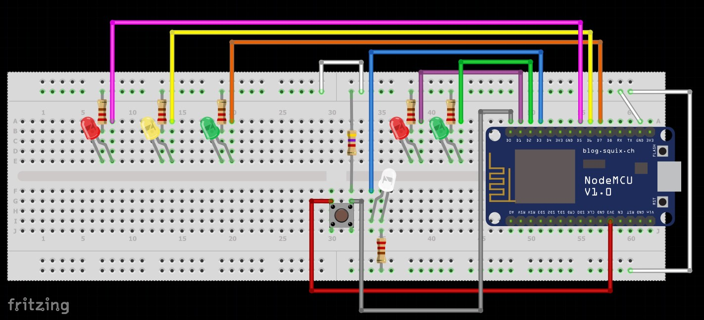
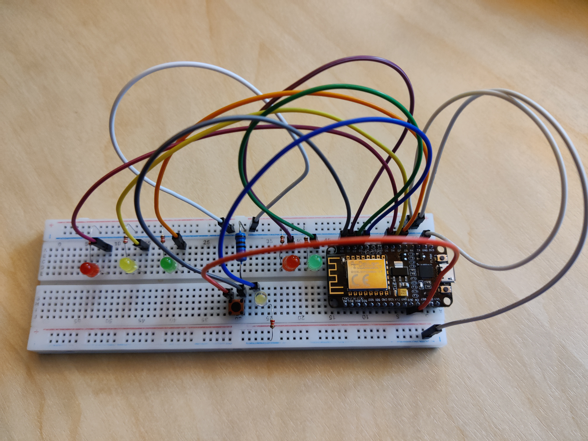

# Anneli valgusfoorid
Koostasin:  
 - 2 foori - ühe füüsilise ja ühe virtuaalse  
 - ning juhtpaaneli, mille abil saab juhtida nii minu kui ka Marilii foore.  

Järgnevates lõikudes kirjeldan neid veidi lähemalt

 

## Füüsiline valgusfoor (riistvaraline pool)
Selle foori koostamiseks kasutasin:  
- 1 NodeMCU ESP8266 12-F riistvarakontrollerit  
- 2 punast, 2 rohelist, 1 kollast ja 1 valget LED'i  
- 6 väiksemat takistit (220&#937;) LED'ide jaoks ning 1 suuremat takisti (4,7k&#937;) nupu juures  
- 10 juhet (isa-isa)  
- 1 protoplaati  
- 1 nuppu  

> LED'ide paigutamisel jälgisin, et LED'i lühem jalg (katood) jääks miinuse poole, pikem (anood) aga plussi poole.  

> Et oleks mugavam kogu komplekti hallata siis paigutasin NodeMCU kontrolleri samuti protoplaadi külge.  

> Vältimaks LED'ide läbipõlemist, paigutasin nende juurde ka takistid. [Selle video](https://www.youtube.com/watch?v=NUKD9qESO58) abil sai kinnituse, et takisti paigutamisel ei ole vahet kummale poole LED'i see lisada. Seega panin takisti peale LED'i ning ühendasin selle otse miinuse reale. Nii läks tarvis vähem juhtmeid.  

Valmis 1 jalakäijate ja 1 üks autode foor. Jalakäijate foori juures on ka nupp, mille abil saab (nupurežiimi toimimise ajal) teeületamise soovist märku anda. Nupuvajutuse toimumisest annab märku nupu juures asuv valge LED.  

 

**Valminud foori ühendusskeem ning foto:**  
> Skeemi loomiseks kasutasin [Fritzing tarkvara](https://fritzing.org/)  

  

  

 

## Füüsiline valgusfoor (tarkvaraline pool)
Tarkvara kirjutamisel kasutasin Arduino IDE keskkonda, mille seadistamisel oli abiks järgmine [juhend](https://www.instructables.com/Steps-to-Setup-Arduino-IDE-for-NODEMCU-ESP8266-WiF/). 

Valminud koodiga saab lähemalt tutvuda [siin](https://github.com/Neniariel/trafficlights/blob/main/Anneli/physical_traffic_light.ino)  
> NB! Tegu on suhteliselt algelise lahendusega ning vajab veel redigeerimist ja täiendamist.  

**Olulisemad kohad**  
- [ArduinoJson](https://arduinojson.org/) teek oli abiks https GET päringuga saabunud JSON-i dokumendist andmete kättesaamisel.  
- loop() funktsiooni sees on 3 põhilist tingimuslauset, mille abil kontrollin, kas parasjagu on valitud öö, automaatne või nupuvajutusele reageeriv režiim. Ja seejärel käivitatakse vastava režiimi funktsioon, mille sees toimub valgusfoori seisundite vahetumine (tingimuseks möödunud aeg millisekundites, seisundi number ja kas on nuppu vajutatud või peaks parasjagu olema rohelise laine aeg).  
  > Seisunditesse panin kirja vaid parasjagu toimuvad muudatused. Nt kui punane LED lülitati 5ndal seisundil sisse siis vahepealsetes seisundites seda LED'i uuesti ei puudutata. Alles teisel seisundil, mil on aeg punane LED välja lülitada, on vastav tegevus just selle seisundi sees kirjas.  
- Kuna algselt kasutatud delay() funktsioon ei lubanud mitmel protsessil korraga toimida siis asendasin selle [millis()](https://www.arduino.cc/reference/en/language/functions/time/millis/) funktsiooniga. Millis'e abil peab kontroller arvet, mitu millisekundit on viimasest valgusfoori seisundi käivitamisest möödunud.  

 

## Virtuaalne valgusfoor
Valminud koodiga saab lähemalt tutvuda [siin](https://github.com/Neniariel/trafficlights/tree/main/Anneli/virtual_traffic_light)  
> NB! Tegu on suhteliselt algelise lahendusega ning vajab veel redigeerimist ja täiendamist.  

**Olulisemad kohad**  
- Kasutasin märksa rohkem erinevaid abifunktsioone, mis muutsid koodi loodetavasti ka paremini loetavamaks.  
- Analoogselt füüsilise valgusfoori toimimisele, jälgib programmi loop() osa, millise režiimiga on parasjagu tegu ning käivitab vastava tingimuslause osa, kus toimuvad seisundite vahetumised (tingimuseks möödunud aeg millisekundites, seisundi number ja kas on nuppu vajutatud või peaks parasjagu olema rohelise laine aeg).  
- Kui Arduinos kasutasin millis() funktsiooni siis virtuaalse valgusfoori puhul teeb sama töö ära [performance.now()](https://developer.mozilla.org/en-US/docs/Web/API/Performance/now)  

 

## Valgusfooride seisundid
> Seisundite tabelites kasutatud emotikoonid leidsin [GitHub Emoij Picker](https://github-emoji-picker.vercel.app/) abil.  

:vertical_traffic_light: **Nupuvajutuse režiimi ajal**  

| Seisund |                       :car:                   |               :walking:       | :white_medium_square: |                   Selgitus...               |             Aeg              |
|   :-:   |                        :-:                    |                  :-:          |          :-:          |                     :-:                     |             :-:              |
| 0       | :red_circle: :black_circle: :black_circle:    | :red_circle: :black_circle:   | :black_circle:        |                                             |              1s              |
| 1       | :red_circle: :yellow_circle: :black_circle:   | :red_circle: :black_circle:   | :black_circle:        |                                             |              1s              |
| 2       | :black_circle: :black_circle: :green_circle:  | :red_circle: :black_circle:   | :black_circle:        | N-ö vaikeseisund - oodatakse nupuvajutust.  | seni kuni on nuppu vajutatud |
| 8       | :black_circle: :black_circle: :green_circle:  | :red_circle: :black_circle:   | :white_circle:        | Peale nupuvajutust rakendub 3s ooteaega.    |              3s              |
| 3       | :black_circle: :black_circle: :green_circle:  | :red_circle: :black_circle:   | :white_circle:        | Autode roheline LED vilgub                  |              2s              |
| 4       | :black_circle: :yellow_circle: :black_circle: | :red_circle: :black_circle:   | :white_circle:        |                                             |              1s              |
| 5       | :red_circle: :black_circle: :black_circle:    | :red_circle: :black_circle:   | :white_circle:        |                                             |              1s              |
| 6       | :red_circle: :black_circle: :black_circle:    | :black_circle: :green_circle: | :black_circle:        |                                             |         40% vahest           |
| 7       | :red_circle: :black_circle: :black_circle:    | :black_circle: :green_circle: | :black_circle:        | Jalakäijate roheline LED vilgub.            |              2s              |

> Jalakäijate nupu LED võib süttida ka juba varem (v.a seisundites, mil jalakäijale kehtib roheline tuli)  

> 6nda seisundi kestvusaja arvutamisel võetakse arvesse kogu fooritsükli pikkust. Seejärel lahutatakse saadud arvust teiste kindlate pikkustega seisundite kestvusajad. Ning saadud vahest võetakse 40%. See ongi 6nda seisundi kestvusaeg.  

 

:vertical_traffic_light: **Automaatika režiimi ajal**  

Võrreldes nupuvajutuse režiimiga, on automaatika režiimis paar erinevust. Nimelt:  

- "2." seisundi kestvusaeg on 60% vahest.  
- Kaheksas seisund jäetakse vahele.  
- Nupu tuluke ei põle.  

 

:vertical_traffic_light: **ÖÖ režiimi ajal**  

| Seisund |                       :car:                    |                :walking:          | :white_medium_square: |           Selgitus...           |    Kestvus   |
|   :-:   |                        :-:                     |                   :-:             |          :-:          |               :-                |      :-:     |
|    9    | :black_circle: :yellow_circle: :black_circle:  | :black_circle: :black_circle:     | :black_circle:        | Autode kollane LED vilgub.      |              |

> Tegelikult minu kirjutatud koodis veel sellel seisundil numbrit ei ole, kuna antud seisundi rakendamiseks piisab juba sellest, kui režiimimuutuse järgselt on käesolevaks reziimiks öörežiim. Seejärel käivitatakse 9nda seisundi tegevus ehk kollase tule vilgutamine (1s põleb, 1s kustus, jne). Vilgutamine kestab seni kuni toimub järgmine režiimivahetus, mille tulemusena käivitatakse siis juba, kas nupuvajutuse või automaatne režiim.  

> Öörežiimist väljudes rakendub 0. seisund!  

 

:vertical_traffic_light: **Rohelise laine ajal**  

Rohelise laine käivitamisel arvutatakse fooride ajaline viivitus:  

| Laine suund |       Anneli NodeMCU foor         |          Anneli virtuaalne foor        |
|    :-:      |                    :-:            |                :-:                     |
| paremale    | "1-2" + "2-3" viivituste summa    | "1-2" + "2-3" + "3-4" viivituste summa |
| vasakule    | võrdub "3-4" viivituse väärtusega |  0s                                    |

 

## Juhtpaneel
Koostasin juhtpaneeli, mille abil saab juhtida nii minu kui ka Marilii foore.  

Valminud koodiga saab lähemalt tutvuda [siin](https://github.com/Neniariel/trafficlights/tree/main/Anneli/traffic_lights_control_panel)  
> NB! Tegu on suhteliselt algelise lahendusega ning vajab veel redigeerimist ja täiendamist.  

**Olulisemad kohad**  
- Juhtpaneeli kaudu saab juhtida nii iga foori eraldi, kui ka kõiki korraga (rohelise laine tekitamiseks).  
- Koodi kirjutamisel katsetasin, et kas õnnestub kasutada vähem if/else tingimuslauseid. Olin hiljuti lugenud ühte artikklit, kus soovitati eelistada "Object Literals" lähenemist.  

 

## Mõtted ja ideed edasise arenduse osas
- Valminud kood tahaks kohendamist, kuna seal leidub osaliselt veel korduvat koodi, mille sooviksin eraldi funktsioonidesse tõsta. Ning abifunktsioonid omaette moodulitesse liigutada.  
- Fooride juhtpaneel ning minu virtuaalne foor ei ole täna veel täienisti kohalduva disainiga. Seda sooviksin kindlasti parandada.  
- Rohelise laine toimimise loogika vajab kontrollimist. Videote filmimise käigus märkasin, et laine ei jää püsima.  
- NodeMCU toimetamise kiirendamiseks võiks korra lähemalt uurida, mida kujutab endast Firebase'i teek (mis on mõeldud just ESP8266 kontrolleritele). Virtuaalne foor ja juhtpaneel saavad automaatselt (peale andmete muutumist) uued andmed kätte, siis tahaks, et ka NodeMCU kontroller toimiks samamoodi. Muidu hetkel teeb NodeMCU ise päringuid (ka siis kui andmed ei ole muutunud).  
- Juhtpaneeli input väljad vajaksid sisestatud väärtuste korrektsemat kontrolli. Hetkel on seal toimimas vaid input'i enda inputmode = "numeric" nimeline atribuut.  
- Juhtpaneeli bugi vajab parandamist. Kui veebilehte refreshida (laine töötamise ajal) siis järgmisel korral lainet enam käivitada ei õnnestu.  